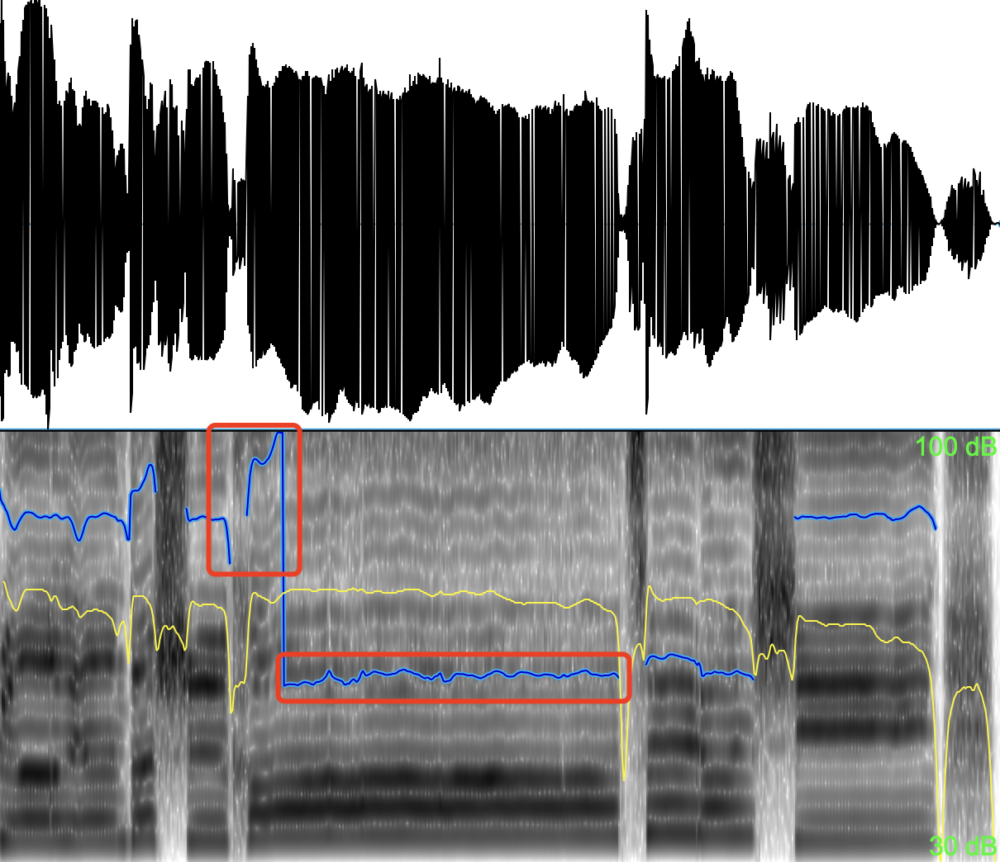
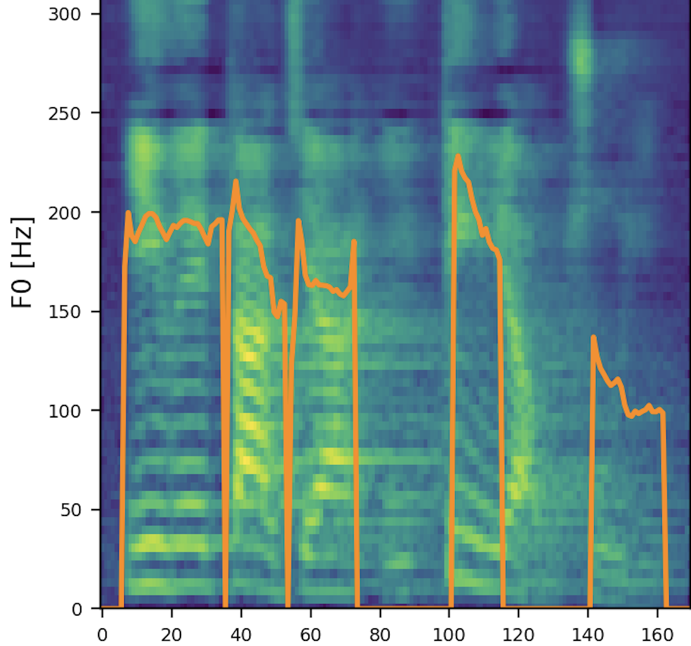
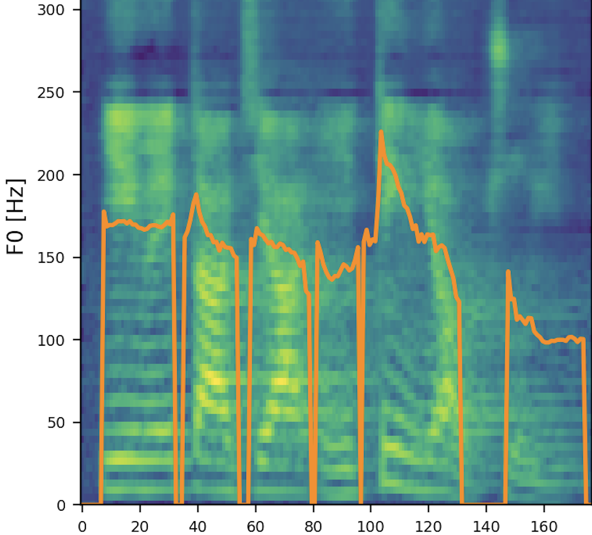

# Abstract

  This paper presents an end-to-end high-quality singing voice synthesis (SVS) system that uses bidirectional encoder representation from Transformers (BERT) derived semantic embeddings to improve the expressiveness of the synthesized singing voice.Based on the main architecture of recently proposed VISinger, we put forward several specific designs for expressive singing voice synthesis.First, different from the previous SVS models, we use text representation of lyrics extracted from pre-trained BERT as additional input to the model. The representation contains information about semantics of the lyrics, which could help SVS system produce more expressive and natural voice. Second, we further introduce an energy predictor to stabilize the synthesized voice and model the wider range of energy variations that also contribute to the expressiveness of singing voice. Last but not the least, to attenuate the off-key issues, the pitch predictor is re-designed to predict the real to note pitch ratio. Both objective and subjective experimental results prove that the proposed SVS system can produce singing voice with higher-quality outperforming VISinger.

# Subjective Evaluation 
To demonstrate that our proposed model can significantly improve the naturalness and expressiveness of the synthesized singing voice, some samples are provided for comparison. **GT** means ground truth. **VISinger** represents the baseline model we are comparing, and **Proposed** means the proposed model with semantic extraction module、energy predictor and pitch predictor, which are described in detail in the paper. 

| Target Chinese Text | GT | VISinger | Proposed |
| :---- | :---- | :---- | :---- | :---- |
| 昂首到达每一个地方这世界的太阳 | <audio controls><source src="./wavs/gt/0.wav" type="audio/wav">Your browser does not support the audio element.</audio> | <audio controls><source src="./wavs/visinger/0.wav" type="audio/wav">Your browser does not support the audio element.</audio> | <audio controls><source src="./wavs/proposed/0.wav" type="audio/wav">Your browser does not support the audio element.</audio> |
| 右手左手慢动作重播 | <audio controls><source src="./wavs/gt/1.wav" type="audio/wav">Your browser does not support the audio element.</audio> | <audio controls><source src="./wavs/visinger/1.wav" type="audio/wav">Your browser does not support the audio element.</audio> | <audio controls><source src="./wavs/proposed/1.wav" type="audio/wav">Your browser does not support the audio element.</audio> |
| 这首歌给你快乐你有没有爱上我 | <audio controls><source src="./wavs/gt/2.wav" type="audio/wav">Your browser does not support the audio element.</audio> | <audio controls><source src="./wavs/visinger/2.wav" type="audio/wav">Your browser does not support the audio element.</audio> | <audio controls><source src="./wavs/proposed/2.wav" type="audio/wav">Your browser does not support the audio element.</audio> |
| 我的勇敢充满电量 | <audio controls><source src="./wavs/gt/3.wav" type="audio/wav">Your browser does not support the audio element.</audio> | <audio controls><source src="./wavs/visinger/3.wav" type="audio/wav">Your browser does not support the audio element.</audio> | <audio controls><source src="./wavs/proposed/3.wav" type="audio/wav">Your browser does not support the audio element.</audio> |
| 这舞台的中央有我才闪亮                     | <audio controls><source src="./wavs/gt/4.wav" type="audio/wav">Your browser does not support the audio element.</audio> | <audio controls><source src="./wavs/visinger/4.wav" type="audio/wav">Your browser does not support the audio element.</audio> | <audio controls><source src="./wavs/proposed/4.wav" type="audio/wav">Your browser does not support the audio element.</audio> |
我还在寻找一个依靠                     | <audio controls><source src="./wavs/gt/6.wav" type="audio/wav">Your browser does not support the audio element.</audio> | <audio controls><source src="./wavs/visinger/6.wav" type="audio/wav">Your browser does not support the audio element.</audio> | <audio controls><source src="./wavs/proposed/6.wav" type="audio/wav">Your browser does not support the audio element.</audio> |
幸福开始有预兆                     | <audio controls><source src="./wavs/gt/7.wav" type="audio/wav">Your browser does not support the audio element.</audio> | <audio controls><source src="./wavs/visinger/7.wav" type="audio/wav">Your browser does not support the audio element.</audio> | <audio controls><source src="./wavs/proposed/7.wav" type="audio/wav">Your browser does not support the audio element.</audio> |
缘分让我们慢慢紧靠                     | <audio controls><source src="./wavs/gt/8.wav" type="audio/wav">Your browser does not support the audio element.</audio> | <audio controls><source src="./wavs/visinger/8.wav" type="audio/wav">Your browser does not support the audio element.</audio> | <audio controls><source src="./wavs/proposed/8.wav" type="audio/wav">Your browser does not support the audio element.</audio> |
小酒窝长睫毛是你最美的记号                     | <audio controls><source src="./wavs/gt/9.wav" type="audio/wav">Your browser does not support the audio element.</audio> | <audio controls><source src="./wavs/visinger/9.wav" type="audio/wav">Your browser does not support the audio element.</audio> | <audio controls><source src="./wavs/proposed/9.wav" type="audio/wav">Your browser does not support the audio element.</audio> |
我每天睡不着想念你的微笑                     | <audio controls><source src="./wavs/gt/10.wav" type="audio/wav">Your browser does not support the audio element.</audio> | <audio controls><source src="./wavs/visinger/10.wav" type="audio/wav">Your browser does not support the audio element.</audio> | <audio controls><source src="./wavs/proposed/10.wav" type="audio/wav">Your browser does not support the audio element.</audio> |
小酒窝长睫毛迷人的无可救药                     | <audio controls><source src="./wavs/gt/11.wav" type="audio/wav">Your browser does not support the audio element.</audio> | <audio controls><source src="./wavs/visinger/11.wav" type="audio/wav">Your browser does not support the audio element.</audio> | <audio controls><source src="./wavs/proposed/11.wav" type="audio/wav">Your browser does not support the audio element.</audio> |

* * *

# Ablation Study 
### Investigation on knowledge distillation training strategy

| Target Chinese Text |  GT ｜ Proposed | without semantic | without energy | with reversed SEM ｜
| :---- | :---- | :---- | :---- ｜:---- ｜:---- ｜:---- ｜
| 昂首到达每一个地方这世界的太阳 | <audio controls><source src="./wavs/gt/0.wav" type="audio/wav">Your browser does not support the audio element.</audio> | <audio controls><source src="./wavs/proposed/0.wav" type="audio/wav">Your browser does not support the audio element.</audio> | <audio controls><source src="./wavs/lab5/0.wav" type="audio/wav">Your browser does not support the audio element.</audio> | <audio controls><source src="./wavs/lab2/0.wav" type="audio/wav">Your browser does not support the audio element.</audio>｜<audio controls><source src="./wavs/lab4/0.wav" type="audio/wav">Your browser does not support the audio element.</audio>｜
| 右手左手慢动作重播 | <audio controls><source src="./wavs/gt/1.wav" type="audio/wav">Your browser does not support the audio element.</audio> | <audio controls><source src="./wavs/proposed/1.wav" type="audio/wav">Your browser does not support the audio element.</audio> | <audio controls><source src="./wavs/lab5/1.wav" type="audio/wav">Your browser does not support the audio element.</audio> | <audio controls><source src="./wavs/lab2/1.wav" type="audio/wav">Your browser does not support the audio element.</audio>｜<audio controls><source src="./wavs/lab4/1.wav" type="audio/wav">Your browser does not support the audio element.</audio>｜
| 这首歌给你快乐你有没有爱上我 | <audio controls><source src="./wavs/gt/2.wav" type="audio/wav">Your browser does not support the audio element.</audio> | <audio controls><source src="./wavs/proposed/2.wav" type="audio/wav">Your browser does not support the audio element.</audio> | <audio controls><source src="./wavs/lab5/2.wav" type="audio/wav">Your browser does not support the audio element.</audio> | <audio controls><source src="./wavs/lab2/2.wav" type="audio/wav">Your browser does not support the audio element.</audio>｜<audio controls><source src="./wavs/lab4/2.wav" type="audio/wav">Your browser does not support the audio element.</audio>｜
| 我的勇敢充满电量 | <audio controls><source src="./wavs/gt/3.wav" type="audio/wav">Your browser does not support the audio element.</audio> | <audio controls><source src="./wavs/proposed/3.wav" type="audio/wav">Your browser does not support the audio element.</audio> | <audio controls><source src="./wavs/lab5/3.wav" type="audio/wav">Your browser does not support the audio element.</audio> | <audio controls><source src="./wavs/lab2/3.wav" type="audio/wav">Your browser does not support the audio element.</audio>｜<audio controls><source src="./wavs/lab4/3.wav" type="audio/wav">Your browser does not support the audio element.</audio>｜
| 这舞台的中央有我才闪亮                     | <audio controls><source src="./wavs/gt/4.wav" type="audio/wav">Your browser does not support the audio element.</audio> | <audio controls><source src="./wavs/proposed/4.wav" type="audio/wav">Your browser does not support the audio element.</audio> | <audio controls><source src="./wavs/lab5/4.wav" type="audio/wav">Your browser does not support the audio element.</audio> | <audio controls><source src="./wavs/lab2/4.wav" type="audio/wav">Your browser does not support the audio element.</audio>｜<audio controls><source src="./wavs/lab4/4.wav" type="audio/wav">Your browser does not support the audio element.</audio>｜
我还在寻找一个依靠                     | <audio controls><source src="./wavs/gt/5.wav" type="audio/wav">Your browser does not support the audio element.</audio> | <audio controls><source src="./wavs/proposed/5.wav" type="audio/wav">Your browser does not support the audio element.</audio> | <audio controls><source src="./wavs/lab5/5.wav" type="audio/wav">Your browser does not support the audio element.</audio> | <audio controls><source src="./wavs/lab2/5.wav" type="audio/wav">Your browser does not support the audio element.</audio>｜<audio controls><source src="./wavs/lab4/5.wav" type="audio/wav">Your browser does not support the audio element.</audio>｜
幸福开始有预兆                     | <audio controls><source src="./wavs/gt/6.wav" type="audio/wav">Your browser does not support the audio element.</audio> | <audio controls><source src="./wavs/proposed/6.wav" type="audio/wav">Your browser does not support the audio element.</audio> | <audio controls><source src="./wavs/lab5/6.wav" type="audio/wav">Your browser does not support the audio element.</audio> | <audio controls><source src="./wavs/lab2/6.wav" type="audio/wav">Your browser does not support the audio element.</audio>｜<audio controls><source src="./wavs/lab4/6.wav" type="audio/wav">Your browser does not support the audio element.</audio>｜
缘分让我们慢慢紧靠                     | <audio controls><source src="./wavs/gt/7.wav" type="audio/wav">Your browser does not support the audio element.</audio> | <audio controls><source src="./wavs/proposed/7.wav" type="audio/wav">Your browser does not support the audio element.</audio> | <audio controls><source src="./wavs/lab5/7.wav" type="audio/wav">Your browser does not support the audio element.</audio> | <audio controls><source src="./wavs/lab2/7.wav" type="audio/wav">Your browser does not support the audio element.</audio>｜<audio controls><source src="./wavs/lab4/7.wav" type="audio/wav">Your browser does not support the audio element.</audio>｜
小酒窝长睫毛是你最美的记号                     | <audio controls><source src="./wavs/gt/8.wav" type="audio/wav">Your browser does not support the audio element.</audio> | <audio controls><source src="./wavs/proposed/8.wav" type="audio/wav">Your browser does not support the audio element.</audio> | <audio controls><source src="./wavs/lab5/8.wav" type="audio/wav">Your browser does not support the audio element.</audio> | <audio controls><source src="./wavs/lab2/8.wav" type="audio/wav">Your browser does not support the audio element.</audio>｜<audio controls><source src="./wavs/lab4/8.wav" type="audio/wav">Your browser does not support the audio element.</audio>｜
我每天睡不着想念你的微笑                     | <audio controls><source src="./wavs/gt/9.wav" type="audio/wav">Your browser does not support the audio element.</audio> | <audio controls><source src="./wavs/proposed/9.wav" type="audio/wav">Your browser does not support the audio element.</audio> | <audio controls><source src="./wavs/lab5/9.wav" type="audio/wav">Your browser does not support the audio element.</audio> | <audio controls><source src="./wavs/lab2/9.wav" type="audio/wav">Your browser does not support the audio element.</audio>｜<audio controls><source src="./wavs/lab4/9.wav" type="audio/wav">Your browser does not support the audio element.</audio>｜
小酒窝长睫毛迷人的无可救药                     |<audio controls><source src="./wavs/gt/10.wav" type="audio/wav">Your browser does not support the audio element.</audio> | <audio controls><source src="./wavs/proposed/10.wav" type="audio/wav">Your browser does not support the audio element.</audio> | <audio controls><source src="./wavs/lab5/10.wav" type="audio/wav">Your browser does not support the audio element.</audio> | <audio controls><source src="./wavs/lab2/10.wav" type="audio/wav">Your browser does not support the audio element.</audio>｜<audio controls><source src="./wavs/lab4/10.wav" type="audio/wav">Your browser does not support the audio element.</audio>｜

<!-- 
### Investigation on hierarchical context encoder

| Target Chinese Text | Proposed | without hierarchical context encoder |
| :---- | :---- | :---- |
| 啊，这个成绩是什么呢？客观题。 | <audio controls><source src="./wavs/cmos2/1.wav" type="audio/wav">Your browser does not support the audio element.</audio> | <audio controls><source src="./wavs/cmos2/-1.wav" type="audio/wav">Your browser does not support the audio element.</audio> |
| 它其实属于第几款呢？ | <audio controls><source src="./wavs/cmos2/2.wav" type="audio/wav">Your browser does not support the audio element.</audio> | <audio controls><source src="./wavs/cmos2/-2.wav" type="audio/wav">Your browser does not support the audio element.</audio> |
| 叫余平故意泄露国家秘密罪。 | <audio controls><source src="./wavs/cmos2/3.wav" type="audio/wav">Your browser does not support the audio element.</audio> | <audio controls><source src="./wavs/cmos2/-3.wav" type="audio/wav">Your browser does not support the audio element.</audio> |
| 但现在同学们学了刑法。 | <audio controls><source src="./wavs/cmos2/4.wav" type="audio/wav">Your browser does not support the audio element.</audio> | <audio controls><source src="./wavs/cmos2/-4.wav" type="audio/wav">Your browser does not support the audio element.</audio> |
| 我们不要对自己抱以太高的期望。 | <audio controls><source src="./wavs/cmos2/5.wav" type="audio/wav">Your browser does not support the audio element.</audio> | <audio controls><source src="./wavs/cmos2/-5.wav" type="audio/wav">Your browser does not support the audio element.</audio> |

* * *

# Case Study
To explore the impact of contextual information on the expressiveness of synthesized speech, a case study is conducted to synthesize the same utterance with different context: i) using ground-truth context (original context); ii) randomly selecting 4 sentences and itself as context (irrelevant context); iii) using current sentence only (no context).

| Context | Target Chinese Text | Audio | Mel-Spectrogram |
| :---- | :---- | :---- | :---: |
| original context | 因为大家一定要注意。 | <audio controls><source src="./wavs/casestudy/proposed.wav" type="audio/wav">Your browser does not support the audio element.</audio> |  |
| irrelevant context | 因为大家一定要注意。 | <audio controls><source src="./wavs/casestudy/random.wav" type="audio/wav">Your browser does not support the audio element.</audio> |  |
| no context | 因为大家一定要注意。 | <audio controls><source src="./wavs/casestudy/self.wav" type="audio/wav">Your browser does not support the audio element.</audio> |  | -->

